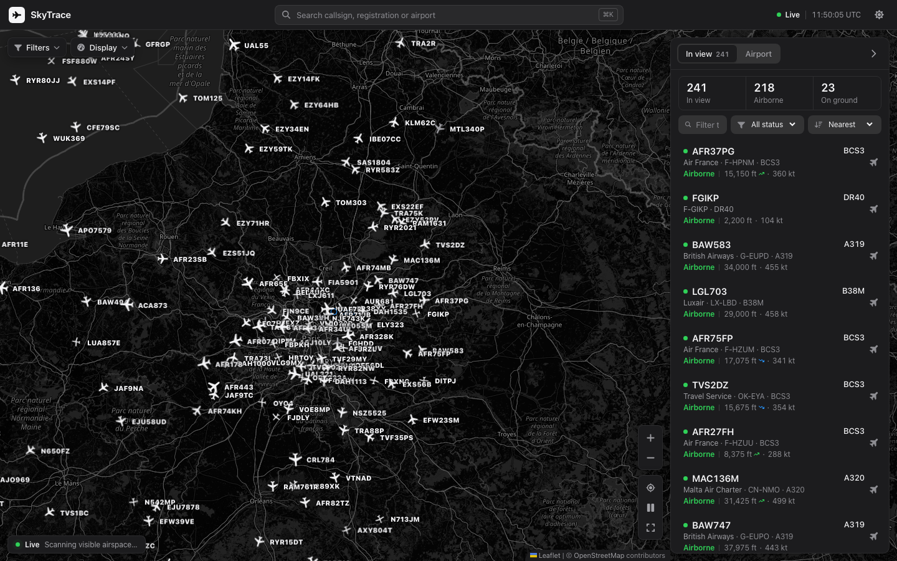
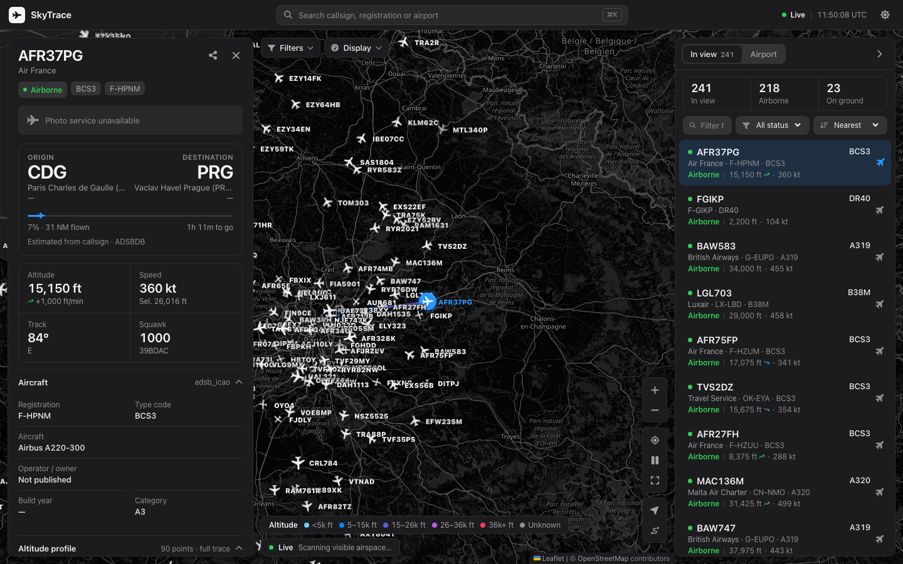
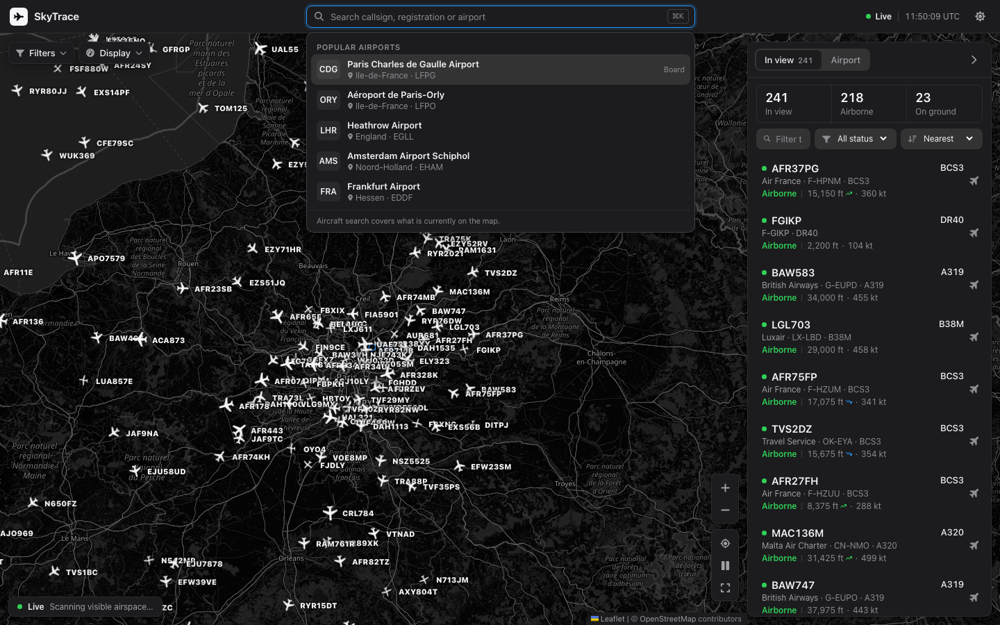
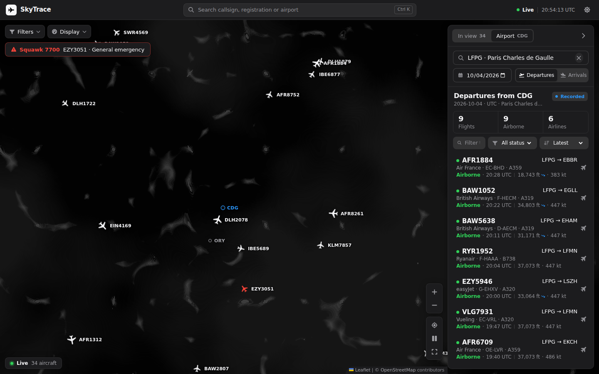
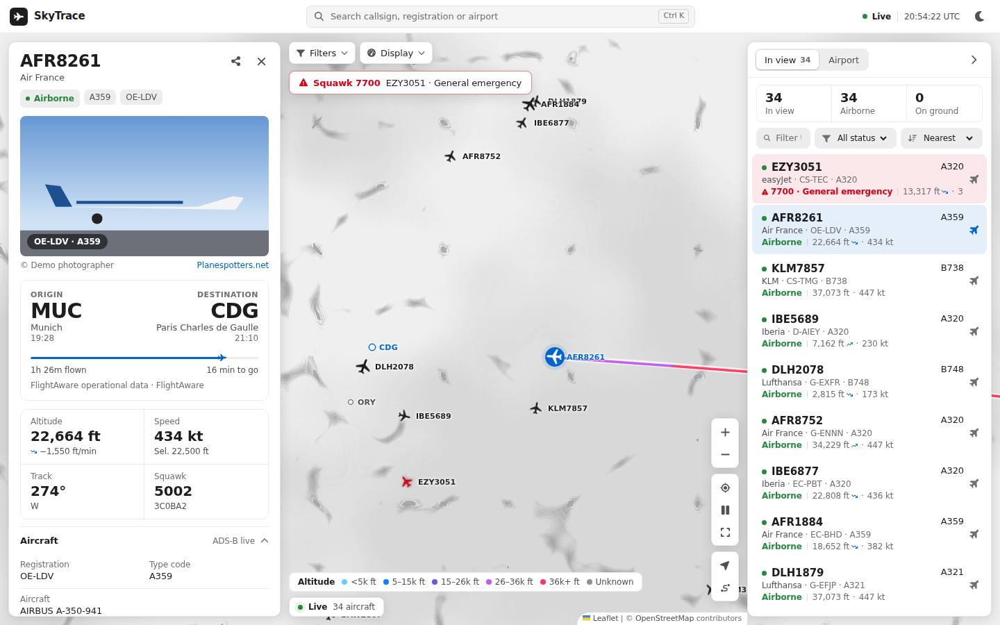
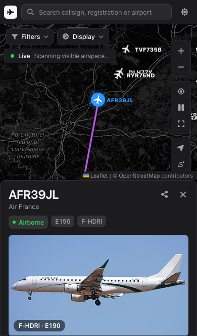

# SkyTrace

Explore the aircraft above you, follow a flight across the map, or inspect traffic around an airport. SkyTrace combines live positions, recorded airport movements, route details and aircraft profiles in one responsive interface.

[Open the public demo](https://opensky-flight-tracking.vercel.app/) · [Run locally](#run-locally) · [Data and privacy](#data-and-privacy)

## What you can do

- **Explore live traffic.** Pan and zoom the map, filter aircraft by altitude or identity, switch units and map theme, and spot emergency squawks. Aircraft with enough position data glide between feed updates.
- **Inspect a flight.** Select an aircraft for its current altitude, speed, route, profile, photo and available operational details. The map makes one purposeful camera move; use **Follow** to stay with it or **Show full route** to frame its trace.
- **Search in one place.** Find a visible aircraft by callsign, registration, type or airline, or find an airport by name, city, IATA or ICAO code.
- **Find airports on the map.** Blue markers cover all geolocated airports in the bundled catalogue. Nearby markers form numbered groups; click to zoom in, then open arrivals and departures. Use **Display → Favourite airports only** to limit the markers to your saved airports.
- **Find airports near you.** Choose **Nearby airports**, allow browser geolocation, and open one of the five closest airports, sorted by distance. Distances are calculated in your browser.
- **Explore an airport.** Review UTC departures and arrivals, then filter or sort the list. When recorded movements are unavailable, SkyTrace labels the live airport snapshot clearly.
- **Keep your context.** Share a selected flight by URL. Recent airports, favourites and display preferences stay in your browser.

The same workflows are available on desktop and phone. Data coverage and enrichment depend on the providers; unknown routes and delayed feeds are labelled in the interface.

## Real screenshots

These are **browser screenshots of the running site**, captured on 5 October 2026 from the current local frontend connected to the public SkyTrace API. The maps use real OpenStreetMap tiles and the aircraft are live API responses. No traffic, map tiles or photos were generated for these images. Live positions and availability will differ when you open the demo.

### Live map



### Selected flight



### Search and airport board





### Light theme and phone





## Keyboard shortcuts

| Key | Action |
| --- | --- |
| `⌘K`, `Ctrl K` or `/` | Focus search |
| `↑`, `↓`, `Enter` | Navigate and select search or flight results |
| `F` | Toggle following the selected aircraft |
| `R` | Frame the selected route |
| `Esc` | Close the active search, menu, full map or flight detail |

## Architecture

- **Frontend:** React, TypeScript, Vite, TanStack Query, React Leaflet
- **Backend:** Python `http.server`, Requests, python-dotenv
- **Data:** OpenSky REST API plus the bundled airport and airline datasets. On Vercel, the authenticated proxy serves complete viewport boxes; public ADS-B sources are used only as a resilient fallback. A selected live aircraft can request short-lived callsign, aircraft-profile, and FlightAware operational enrichment; the interface labels the source of each route.
- **Tests:** Vitest, Testing Library, pytest, and Playwright

The Python server owns all OpenSky authentication. Credentials are never sent to the browser.

## Run locally

Requirements:

- Node.js 22+
- Python 3.10+
- An [OpenSky Network](https://opensky-network.org/) API client

Install dependencies:

```bash
npm install
python3 -m pip install -r requirements-dev.txt
```

Create the local environment file:

```bash
cp .env.example .env
```

Then set both values in `.env`:

```dotenv
OPEN_SKY_CLIENT_ID=your_client_id
OPEN_SKY_CLIENT_SECRET=your_client_secret
```

Never commit `.env`. It is already ignored by Git.

## Development

Start the API server:

```bash
python3 server.py
```

In another terminal, start Vite:

```bash
npm run dev
```

Open `http://localhost:5173`. Vite proxies `/api` to the Python server at `http://localhost:8000`.

### Live mode with the deployed APIs

If local OpenSky credentials are unavailable, set `SKYTRACE_API_ORIGIN=https://opensky-flight-tracking.vercel.app` in `.env.local`. The frontend remains on `localhost:5173` for Impeccable Live, while `/api` is proxied to the authenticated production backend. Do not put API secrets in this setting.

## Production build

```bash
npm run build
python3 server.py
```

The server automatically serves `dist/index.html` and its hashed assets. Open `http://localhost:8000`.

## Validation

```bash
npm run lint
npm run test
python3 -m pytest -q
npm run build
npm run test:e2e
```

Unit and E2E tests use deterministic API responses and do not consume OpenSky credits. To perform a live smoke test, configure `.env`, run both servers, and verify health, airport search, arrivals, departures, viewport traffic, and a flight track.

## API endpoints

- `GET /api/health`
- `GET /api/search-airports?q=...&limit=...`
- `GET /api/airports`
- `GET /api/flights?airport=ICAO&date=YYYY-MM-DD&mode=departure|arrival`
- `GET /api/fetch-flights?...` — compatibility alias
- `GET /api/live-flights?lamin=...&lomin=...&lamax=...&lomax=...`
- `GET /api/flight-info?icao24=...&callsign=...`
- `GET /api/track?icao24=...&time=...`

## Data and privacy

The application stores only theme, units, display options (labels, airport markers, panel state), live-refresh preference, recent airports, and favorites in browser `localStorage`. No user account or personal flight history is created. Map tiles come from OpenStreetMap. Flight history comes from OpenSky; on Vercel, live positions use ADSB.lol with Airplanes.live as a fallback. If OpenSky history is unavailable, an airport search returns a clearly labelled live snapshot around the airport so the map and list remain useful; it does not claim those aircraft are historical movements.

Origin and destination for historical records come from OpenSky. For a live aircraft, the selected callsign is resolved on demand through the [ADSBDB callsign API](https://github.com/mrjackwills/adsbdb) and, when configured, the FlightAware AeroAPI connected to the Hermes flight-tracker skill. Both enrichments are cached briefly; a missing or disabled source leaves the route explicitly unknown. The selected hex code also gets a one-shot profile lookup from the ADS-B provider, including registration, type, operator and signal fields. Set `SKYTRACE_ROUTE_LOOKUP_ENABLED=0` or `SKYTRACE_FLIGHTAWARE_ENABLED=0` to disable either enrichment.

FlightAware data is fetched server-side with `FLIGHTAWARE_AEROAPI_KEY`; the key is never sent to the browser. A selected aircraft triggers at most one operational lookup per cache window, with failed lookups held for the retry window. The flight dock shows status, scheduled/estimated/actual times, delays, progress, gates, terminals, and filed route when the provider publishes them.

Live viewport requests use a short in-process cache, a small client request spacing, and a provider-aware refresh cadence. OpenSky state queries cost 1–4 credits based on bounding-box area; the default `SKYTRACE_OPENSKY_DAILY_BUDGET=3000` targets 3,000 of the standard 4,000 daily credits and yields roughly 30/60/90/120-second polling for increasingly wide boxes. If the configured credentials are rejected, the private proxy can serve current boxes anonymously at a slower cadence sized for the 400-credit anonymous bucket; set `OPEN_SKY_PROXY_ANONYMOUS_FALLBACK=0` to disable that path. The public ADS-B fallback respects the 250 NM point-endpoint limit by merging a bounded grid for wider viewports (`SKYTRACE_LIVE_MAX_TILES`, default 36), pacing cells 1.3 seconds apart by default, and lengthening its polling interval as the grid grows.

## Provider choices

The production stack keeps OpenSky for recorded airport history and complete live bounding boxes when the private proxy is available, then uses ADSB.lol and Airplanes.live for resilient live coverage. A third public feed is not queried on every refresh: adding one would increase latency and could violate its fair-use rules. [ADSB.fi](https://github.com/adsbfi/opendata) is a useful optional source for a future controlled fallback, but its public endpoints are limited to one request per second and personal, non-commercial use.

For a materially faster and quota-free local setup, the most reliable option is a nearby ADS-B receiver running `readsb`/`tar1090`; the server can consume that local feed and use OpenSky only for history and enrichment. Check each provider's current terms before enabling commercial or high-frequency use: [OpenSky REST API](https://github.com/openskynetwork/opensky-api/blob/master/docs/free/rest.rst), [OpenSky terms](https://opensky-network.org/about/terms-of-use), [ADSB.lol open data](https://www.adsb.lol/docs/open-data/api/), and [ADSB.fi limits](https://github.com/adsbfi/opendata#limits).

## License

MIT

Interface icons are from [Font Awesome Free](https://fontawesome.com) (solid set) by Fonticons, Inc., licensed under [CC BY 4.0](https://fontawesome.com/license/free). Regenerate them with `node scripts/build-icons.mjs <fontawesome-free-web-folder>`.

### Free operator timetables

The airport panel now has separate **Timetable** and **Observed traffic** views. Avinor supplies planned arrivals/departures, revised times, cancellations, reported actual events and available gate information for 43 Norwegian airports without a paid API key. Open Oslo with `?airport=ENGM&view=schedule`. Select a UTC day and optionally display local airport times; the panel identifies its source and stale snapshots. Unsupported airports explicitly state their coverage limit instead of treating ADS-B observations as a timetable.

`GET /api/timetable?airport=ENGM&date=YYYY-MM-DD&mode=departure` returns a `coverage` value (`available`, `unsupported`, `out-of-range`, `unavailable`) and scheduled flights. Responses are cached for three minutes; see [source evaluation, licensing, cache limits and metadata provenance](docs/FREE_TIMETABLE_SOURCES.md).
